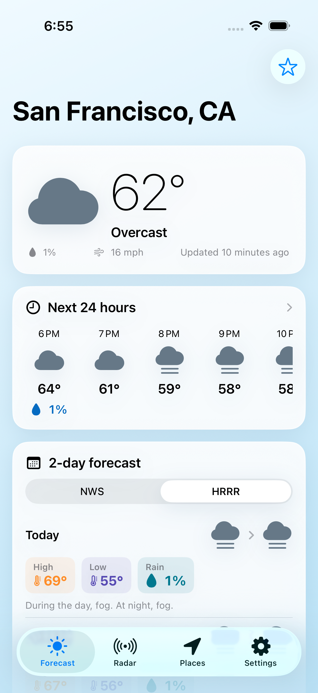
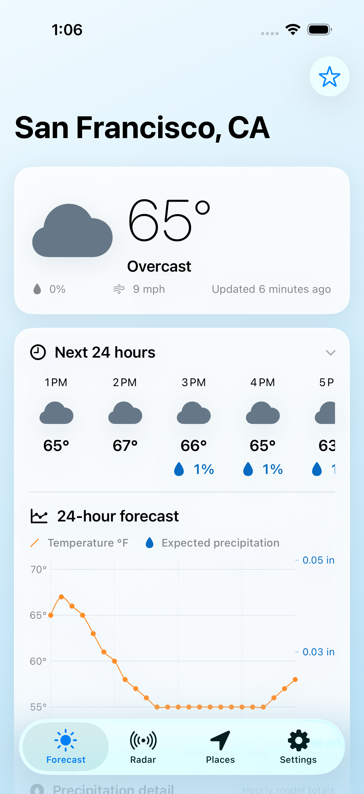
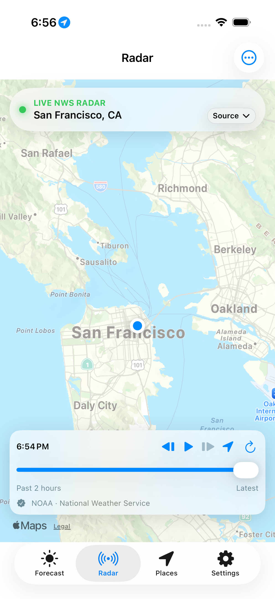
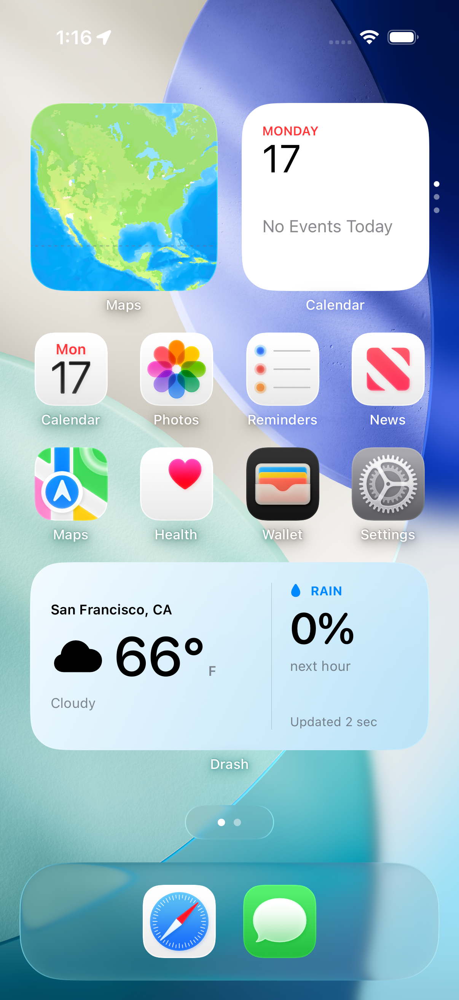

# Drash

Drash is an ad-free, vibe-coded weather app for iPhone and iPad powered by the official U.S. National Weather Service API.

Created by [Thomas Gillis](https://github.com/thomasgillis) in Boulder, for all my outdoorsy friends.

## Screenshots

<table>
  <tr>
    <td></td>
    <td></td>
    <td></td>
    <td></td>
  </tr>
  <tr>
    <td align="center">Forecast</td>
    <td align="center">Temperature &amp; precipitation</td>
    <td align="center">Observed NWS radar</td>
    <td align="center">Home Screen widget</td>
  </tr>
</table>

## Included in 0.0.9

- A shared HRRR/NWS source setting for current conditions and the expandable next-24-hours card
- Per-place daily switching between the seven-day NWS outlook and HRRR's shorter horizon
- Detailed day/night forecasts and active NWS alerts
- A tappable 24-hour temperature and expected-precipitation chart
- Radar switching between HRRR simulated reflectivity and recent NWS observations, with playback and map controls
- A dedicated My Location place that follows fresh GPS fixes, plus U.S. place/ZIP search and saved places
- Private iCloud sync for saved places and each place's daily forecast-source choice
- Fast offline search for U.S. state and national parks, Colorado 13ers, all 58 named Colorado 14ers, and continental-U.S. climbing areas, with manual catalog refresh
- Summit forecasts corrected to each peak's elevation
- Fahrenheit and Celsius, accessible labels, battery-conscious refreshes, and no accounts, ads, analytics, or third-party tracking
- An adaptive iPad interface with large-screen forecast composition, native sidebar navigation, multitasking, and rotation support
- Home Screen and Lock Screen widgets for current temperature and next-hour rain chance

## Install it on your iPhone or iPad

You need a Mac with Xcode, an iPhone or iPad running iOS 18 or newer, and an Apple ID. The default Debug configuration stores saved places locally and supports free Personal Team signing. An active Apple Developer Program membership is required to provision Drash's CloudKit container and build the iCloud-enabled Release configuration.

1. Clone the repository and open the Xcode project:

   ```bash
   git clone https://github.com/thomasgillis/Drash.git
   cd Drash
   open Drash.xcodeproj
   ```

2. In Xcode, open **Xcode → Settings → Accounts** and add your Apple ID if it is not already listed.
3. Select the **Drash** project in the navigator, select the **Drash** app target, and open **Signing & Capabilities**.
4. Enable **Automatically manage signing** and choose your team.
5. Replace `com.tgillis.Drash` with a unique bundle identifier, such as `com.yourname.Drash`.
6. To enable iCloud sync, replace `iCloud.com.tgillis.Drash` in `Drash/DrashCloud.entitlements` and `Drash/Services/SavedPlacesStore.swift` with an iCloud container identifier owned by your paid Developer Program team, such as `iCloud.com.yourname.Drash`. In **Signing & Capabilities**, make sure that container is selected under iCloud and that CloudKit is enabled. Use the Release build configuration when testing sync.
7. Connect your iPhone or iPad to the Mac, unlock it, tap **Trust** if prompted, and select it as the run destination in Xcode.
8. If Xcode asks for Developer Mode, enable it under **Settings → Privacy & Security → Developer Mode** on the device, restart it, and confirm.
9. Press **Run** (`Command–R`). Xcode will build Drash, install it, and open it on the iPhone.
10. On first launch, allow location access, or use the Places tab to search for a U.S. location.

Before distributing a TestFlight or App Store build, run a Release-configuration development build against the container so SwiftData creates the development schema, verify the `SavedPlaceRecord` type in CloudKit Console, and deploy that schema to the production environment.

## Data and coverage

The app calls `api.weather.gov` directly for NWS forecasts, observations, and alerts. The NWS API is free public data and requires an identifying `User-Agent`; this project sends `Drash/1.0 (personal iOS weather app)`. Before public distribution, update that value in `Drash/Services/NWSClient.swift` to include a real app website or support email.

Drash defaults current conditions and the expandable next-24-hours forecast to NOAA HRRR model output from Open-Meteo's GFS & HRRR API. A persistent setting switches both together to the nearest NWS observation and NWS hourly forecast. Daily forecasts independently default to HRRR, and each place retains its choice if you switch to the seven-day NWS outlook. HRRR covers the continental United States at roughly 3 km resolution, updates hourly, and normally provides 18 hours of guidance, extending to 48 hours for the 00Z, 06Z, 12Z, and 18Z runs.

The Places tab searches U.S. state parks from the public-domain USGS PAD-US and Geographic Names Information System datasets, all 63 current national parks, all 58 named Colorado fourteeners, Colorado thirteeners from GNIS, and continental-U.S. climbing areas from OpenBeta's open climbing database. Parks, crags, 13ers, and 14ers ship in an on-device SQLite catalog, so search text never waits on or gets sent to either service and the full catalog is not retained in memory. A manual refresh button validates and atomically installs a newer catalog when one is published. Surveyed 14er elevations and terrain-model elevations for 13ers are sent explicitly to Open-Meteo so HRRR temperature, dew point, pressure, and related conditions are statistically downscaled to the peak instead of the model grid's average height. The NWS API has no target-elevation parameter, so Drash applies the standard 6.5 °C/km environmental lapse rate from the NWS grid elevation to the stored summit elevation for NWS temperatures; NWS wind, precipitation, and weather type remain unmodified grid guidance. For locations without stored elevation, Open-Meteo's 90-meter Copernicus terrain model supplies it and Drash retains the resolved value for subsequent refreshes. Summit current conditions are model guidance; nearby valley weather-station observations are not presented as summit measurements.

Drash does not poll in the background. While the app is active, it automatically checks forecast freshness and refreshes the selected forecast sources after 15 minutes. It requests only a single kilometer-accuracy location fix when the previous current-location forecast is at least 30 minutes old. The visible Radar tab refreshes NWS frames every five minutes and checks for a newer HRRR model run every 15 minutes. Low Power Mode stretches forecast, location, and radar refreshes to one hour. The app cancels in-flight forecast work when backgrounded, destroys the radar map when Radar is hidden or the app is inactive, and disables automatic radar playback in Low Power Mode. Pull to refresh, manual radar frame controls, and the radar refresh button remain available. Persisted per-installation request budgets and provider cooldowns protect both the NWS and Open-Meteo forecast APIs from rapid retries.

Saved places are persisted locally with SwiftData and synchronized between devices through the user's private CloudKit database. An upgrade imports the previous on-device saved-place list once and retains the old payload as a rollback safety net. My Location coordinates, the currently selected place, weather snapshots, provider caches, and the offline outdoor catalog remain device-local.

The on-device app name is **Drash**. **Drash Weather** is the recommended public App Store title so its purpose is immediately clear, while the shorter name remains beneath the Home Screen icon.

NWS point forecasts cover the United States and its territories. The Radar tab defaults to the official CONUS precipitation-radar OGC/WMS layer and provides two hours of recent observed frames. Its optional HRRR mode renders simulated reflectivity from Iowa State University's IEM tile service in 15-minute steps through forecast hour 18. These are observations and model guidance respectively—not interchangeable measurements. The full RIDGE2 viewer remains available from the radar options menu.

## Logical next releases

- Weather alert push notifications (requires an app server or carefully scheduled background refresh)
- Storm-cell movement tracking
- Apple Watch companion
- NWS climate, river, air-quality, fire-weather, hurricane, and snow products
- Custom alert thresholds and alert-type filters
- App icon and App Store artwork

## Project layout

- `Drash/Models`: app data and NWS response models
- `Drash/Services`: NWS and HRRR networking, caching, location, and place search
- `Drash/ViewModels`: screen state and persistence
- `Drash/Views`: forecast, alerts, radar, places, and settings
- `Drash/SupportingFiles`: weather presentation helpers
- `DrashUITests`: end-to-end simulator regression tests

The outdoor catalog is generated locally instead of in GitHub Actions. Enable the repository's pre-push hook once with `git config core.hooksPath .githooks`. Before every push, the hook runs `python3 Tools/build_outdoor_catalog.py --refresh` and stops if `Drash/Resources/outdoor-places.sqlite` needs to be committed. The builder downloads fresh OpenBeta and GNIS sources, normalizes the searchable names, verifies SQLite integrity, and atomically replaces the seed file only when its contents changed. Installed apps download that same file when the user taps **Refresh outdoor places** and reject damaged, incompatible, empty, oversized, or older databases before replacing their working copy.

Requires iOS 18 or newer.
