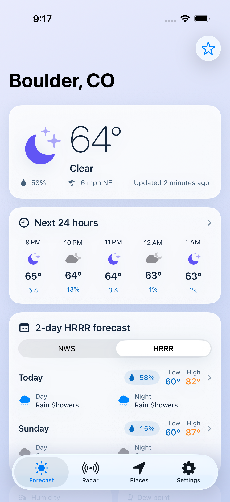
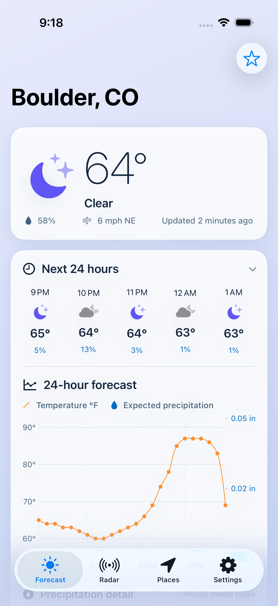
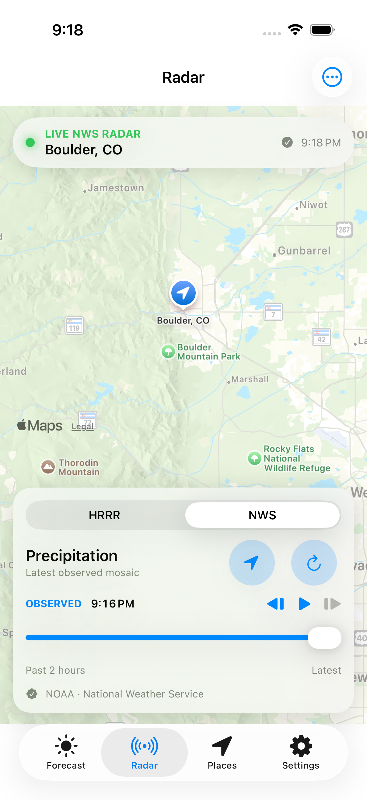

# Drash

Drash is an ad-free, vibe-coded weather app for iPhone powered by the official U.S. National Weather Service API.

Created by [Thomas Gillis](https://github.com/thomasgillis) in Boulder, for all my outdoorsy friends.

## Screenshots

<table>
  <tr>
    <td></td>
    <td></td>
    <td></td>
  </tr>
  <tr>
    <td align="center">Forecast</td>
    <td align="center">Temperature &amp; precipitation</td>
    <td align="center">Observed NWS radar</td>
  </tr>
</table>

## Included in 0.0.3

- An expandable next-24-hours card powered by high-resolution NOAA HRRR guidance
- Per-place daily switching between the seven-day NWS outlook and HRRR's shorter horizon
- Detailed day/night forecasts and active NWS alerts
- A tappable 24-hour temperature and expected-precipitation chart
- Radar switching between HRRR simulated reflectivity and recent NWS observations, with playback and map controls
- Current location, U.S. place/ZIP search, and saved places
- Fahrenheit and Celsius, accessible labels, battery-conscious refreshes, and no accounts, ads, analytics, or third-party tracking

## Install it on your iPhone

You need a Mac with Xcode, an iPhone running iOS 18 or newer, and an Apple ID. A free Apple ID is enough for installing Drash on your own phone.

1. Clone the repository and open the Xcode project:

   ```bash
   git clone https://github.com/thomasgillis/Drash.git
   cd Drash
   open Drash.xcodeproj
   ```

2. In Xcode, open **Xcode → Settings → Accounts** and add your Apple ID if it is not already listed.
3. Select the **Drash** project in the navigator, select the **Drash** app target, and open **Signing & Capabilities**.
4. Enable **Automatically manage signing** and choose your personal team.
5. Replace `com.example.Drash` with a unique bundle identifier, such as `com.yourname.Drash`.
6. Connect your iPhone to the Mac, unlock it, tap **Trust** if prompted, and select it as the run destination in Xcode.
7. If Xcode asks for Developer Mode, enable it under **Settings → Privacy & Security → Developer Mode** on the iPhone, restart the phone, and confirm.
8. Press **Run** (`Command–R`). Xcode will build Drash, install it, and open it on the iPhone.
9. On first launch, allow location access, or use the Places tab to search for a U.S. location.

Personal-team signing is free but expires periodically, so Xcode may need to rebuild and reinstall the app later. A paid Apple Developer membership is required for normal TestFlight or App Store distribution.

## Data and coverage

The app calls `api.weather.gov` directly for NWS forecasts, observations, and alerts. The NWS API is free public data and requires an identifying `User-Agent`; this project sends `Drash/1.0 (personal iOS weather app)`. Before public distribution, update that value in `Drash/Services/NWSClient.swift` to include a real app website or support email.

Drash retrieves NOAA HRRR model output from Open-Meteo's GFS & HRRR API for the expandable next-24-hours forecast while continuing to use NWS observations and alerts. Daily forecasts also default to HRRR, and each place retains its choice if you switch to the seven-day NWS outlook. HRRR covers the continental United States at roughly 3 km resolution, updates hourly, and normally provides 18 hours of guidance, extending to 48 hours for the 00Z, 06Z, 12Z, and 18Z runs.

Drash does not poll in the background. It reuses a recently saved forecast for 15 minutes, requests only a single kilometer-accuracy location fix when the previous current-location forecast is at least 30 minutes old, and stretches both intervals to one hour while Low Power Mode is enabled. It cancels in-flight forecast work when backgrounded, destroys the radar map when Radar is hidden or the app is inactive, and disables automatic radar playback in Low Power Mode. Pull to refresh, manual radar frame controls, and the radar refresh button remain available.

The on-device app name is **Drash**. **Drash Weather** is the recommended public App Store title so its purpose is immediately clear, while the shorter name remains beneath the Home Screen icon.

NWS point forecasts cover the United States and its territories. The Radar tab defaults to the official CONUS precipitation-radar OGC/WMS layer and provides two hours of recent observed frames. Its optional HRRR mode renders simulated reflectivity from Iowa State University's IEM tile service in 15-minute steps through forecast hour 18. These are observations and model guidance respectively—not interchangeable measurements. The full RIDGE2 viewer remains available from the radar options menu.

## Logical next releases

- Weather alert push notifications (requires an app server or carefully scheduled background refresh)
- Home Screen and Lock Screen widgets
- Storm-cell movement tracking
- Apple Watch companion
- NWS climate, river, air-quality, fire-weather, hurricane, and snow products
- Custom alert thresholds and alert-type filters
- App icon and App Store artwork

## Project layout

- `Drash/Models`: app data and NWS response models
- `Drash/Services`: NWS and HRRR networking, caching, location, and place search
- `Drash/ViewModels`: screen state and persistence
- `Drash/Views`: forecast, alerts, radar, places, and settings
- `Drash/SupportingFiles`: weather presentation helpers
- `DrashUITests`: end-to-end simulator regression tests

Requires iOS 18 or newer.
